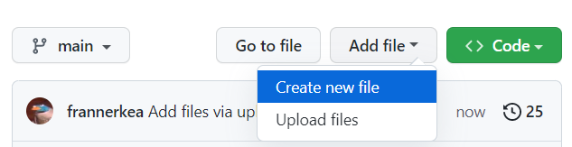
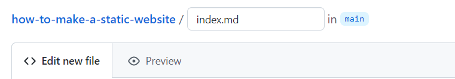
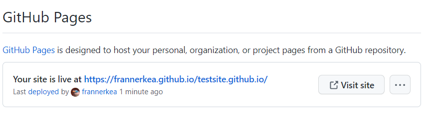

# Your own static website with Github Pages!
<br>

## Introduction  

Welcome to the wonderful world of github and static websites! If you're new to the game, don't you worry - We'll be your guide through this exciting journey. We'll be exploring the power of **Markdown, GitHub, GitHub Pages**, and the static website generator **Jekyll**, to create an easy and beautiful website.  

So, buckle up and get ready to have some fun. By the end of this adventure, you'll be well equipped at using these tools to create your very own static website. Let's get started!  

Btw this whole page was created in **Markdown** 😉

<br>

---  
<br>

## The **'easy'** way!  

1. Go to the **[Github website][github]**, create an account and login. But of course you already have an account, riiiight?!

2. On your Github dashboard, **click on the "+" button** in the top right corner and select **"New repository"**.  


    


3. Give your repository a name like **"username.github.io"**, but replace **"username"** with your actual **Github username**. Make sure to select the option to make the repository public.  


    


4. Now, open a blank text file and write the content you want to include on your website. Save the file as "index.md" and make sure it is saved in github.


    
  
  
    
  
5. Once your file is uptodate, scroll down to the bottom of the page and click on the "Commit changes" button.


  


6. Now lets make the site go live. Under your repository name, click  Settings. If you cannot see the "Settings" tab, select the dropdown menu, then click Settings.


  


7. In the "Code and automation" section of the sidebar, click Pages.


  
  
  
8. Add the branch


  


9. Your website should now be live at "username.github.io". If you go to that website in your web browser, you should see the content you wrote in the "index.md" file.


  


10. To make changes to your website, just edit the "index.md" file in github and remember to commit the change wait a few moments and if everything was done write your site sould be uptodate.


<br>

---
<br>

## The **'imma boss'** way!  

1. Create a new repository on Github with a name like "username.github.io", where "username" is your Github username.  

2. Open a terminal or command prompt and navigate to the folder where you want to store your website files.  

3. Create a new folder for your website and navigate into it.  

4. Create an index.html file with your website content using your preferred text editor.  

5. Initialize a Git repository in the root folder of your website by running the command git init.  

6. Add your website files to the repository by running the command git add . (the "." indicates that you want to add all the files in the current directory).  

7. Commit your changes by running the command git commit -m "Initial commit".  

8. Push your changes to Github by running the command git push origin main.
Visit your website at "username.github.io" in your web browser to confirm that it is live.  
<br>

---
<br>

## How to add a custom theme  

1. Choose a theme: Choose a theme that you like from the available GitHub Pages themes. You can find them at https://pages.github.com/themes/.

2. Create a new file: In the root directory of your repository, create a new file named **_config.yml**. This file will contain your configuration settings for your website.

3. Add theme information: In the _config.yml file, add the following code to specify the theme you want to use:
```
theme: <theme name>
```
4. Replace theme name with the name of the theme you want to use. For example, if you want to use the "Cayman" theme, edit your _config.yml like below.
```
theme: jekyll-theme-cayman
```

5. Commit changes: Commit and push the _config.yml file to your repository.  

<br>

---
<br>

## Markdown and helpfull links

### Markdown  
So what is **Markdown** really? Well this is a technology assigenment, so lets ask [chatGBT][chat] for a definition 😁

> Markdown is a lightweight markup language used for formatting plain text documents with headings, lists, links, and more. It's easy to read and write syntax, making it useful for creating documents and web content, that can be >converted to other formats like HTML or PDF.  
> -ChatGBT  


As mentioned in the introduction, this site was created with **Markdown**. We'll not be going through basic syntax on this site. There is not need because of the abundence of free learning material on the web. But we here are some nice free material! 

<br>

- [Basic Markdown syntax][markdown-syntax] - MarkdownGuide
- [Basic wrtting and formatting][github-markdown] - Github
- [Markdown Crash Course][markdownCC] - Youtube

<br>

### Editors and links

There are different ways to create and edit your markdown-file and here are a few of them.

- Create a file on your laptop and end it with **'md'**. Like this **randomtextfile.md** and go to your Github repository click on **Add file** -> **Upload file**.

- Use **VSCode** directly from your laptop, create a textfile.md and edit it directly from the code-editor. While you're at it, install an extension [Auto-Open Markdown Preview][auto-open]. This will help give you a live preview while you're typing away.  

- Create a file in your **Github repository** by clicking **Add file** -> **Create new file** and use **VSCode** directly from github by creating a **codespace**.  

- Use a free web-application like **stackedit.io**. This editor also has an user interface for the most commmen usage of Markdown, which will **speed-up** the process if you don't remember the syntax.  


    | Program     | Description | Links |
    | ----------- | ----------- | ---------- |
    | VSCode      | From laptop | [VSCode][vsc] |
    | VSCode      | Github Codepace | [Codepspace][codespace] |
    | StackEdit   | Markdown editor | [StackEdit][stackedit] |     


<!-- Links -->
[github]: https://www.github.com/join
[vsc]: https://code.visualstudio.com/download
[stackedit]: https://stackedit.io/
[codespace]: https://github.com/codespaces/new
[auto-open]: https://marketplace.visualstudio.com/items?itemName=hnw.vscode-auto-open-markdown-preview
[chat]: https://chat.openai.com/chat
[markdown-syntax]: https://www.markdownguide.org/basic-syntax/
[github-markdown]: https://docs.github.com/en/get-started/writing-on-github/getting-started-with-writing-and-formatting-on-github/basic-writing-and-formatting-syntax
[markdownCC]: https://www.youtube.com/watch?v=HUBNt18RFbo&t=659s

<br>

---
<br>

